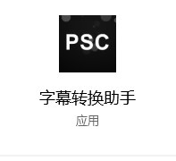
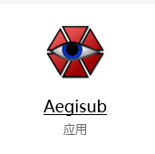
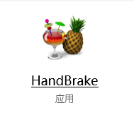
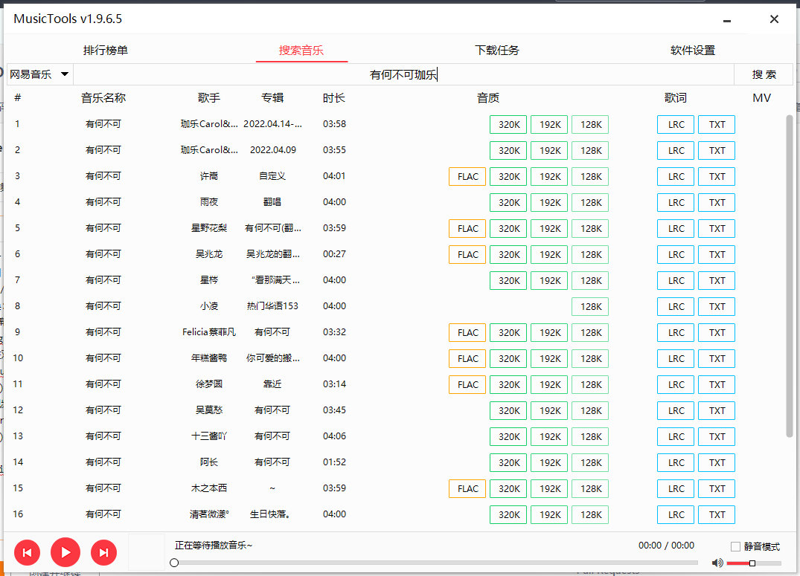
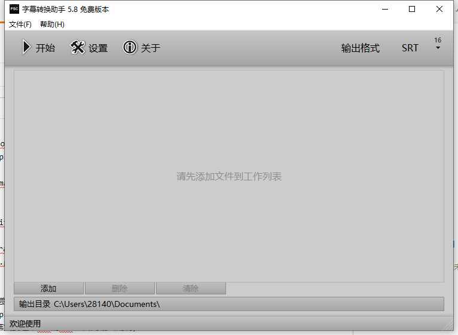
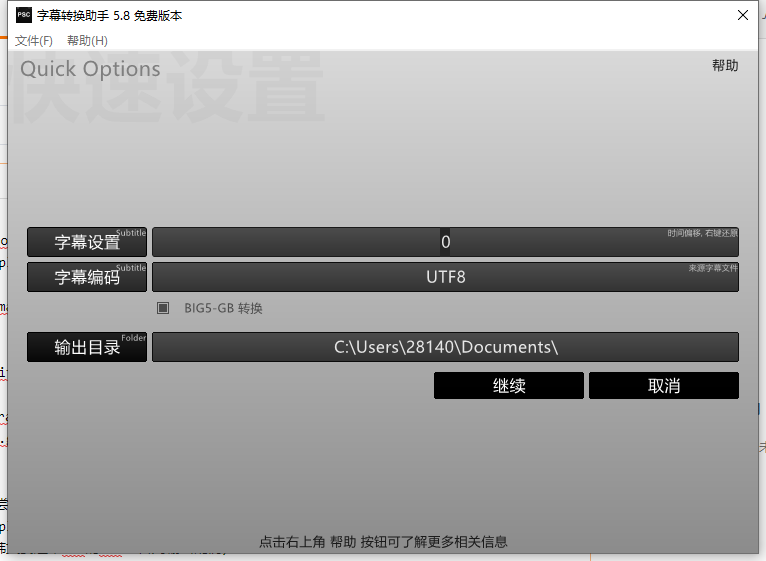
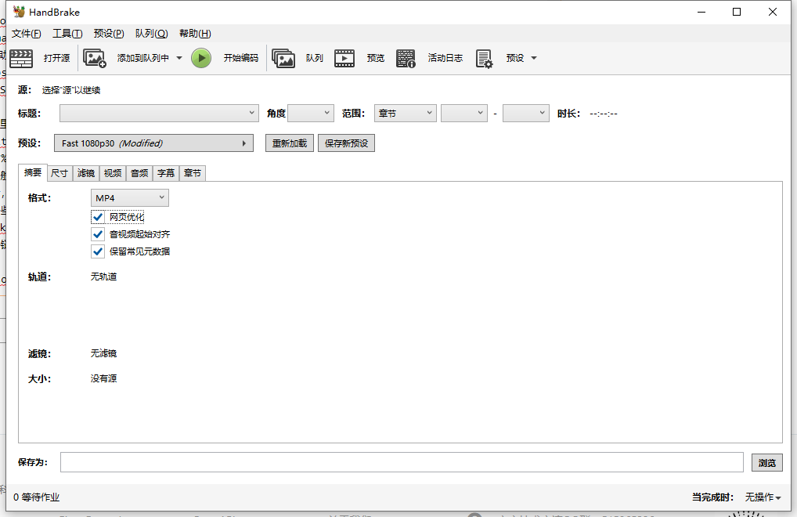
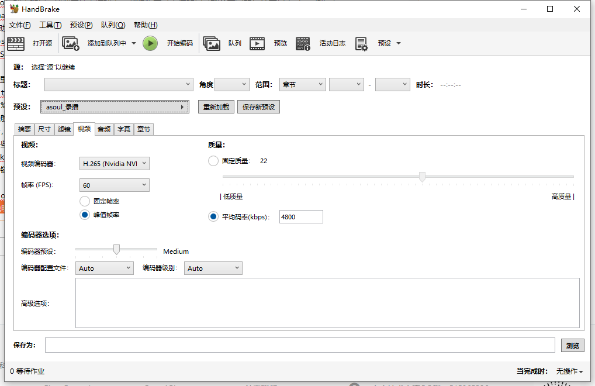
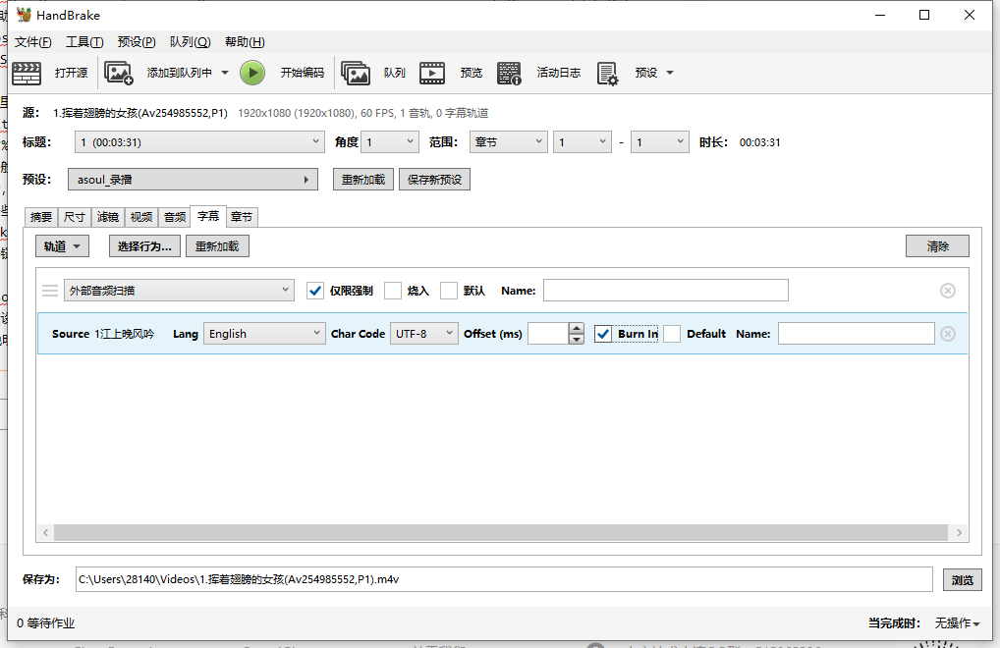

# 歌舞内容切片加字幕

### 工具准备（参考）

!!! info "另请注意：可替换工具"
    这些工具只是作者在工作过程中使用的工具，下文也将以这些工具进行参考。
    
    您可以根据您的工作流适当进行替换，保证大体效果即可。

| 工具用途               | 工具图标                                                     |
| ---------------------- | ------------------------------------------------------------ |
| 下载歌词               |  |
| 歌词转换               |  |
| 调轴、校对、歌词样式   |  |
| 压制、视频头尾冗余修剪 |  |

### 具体步骤
!!!warning "敬请留意：歌词调整"
    A-SOUL 的五个女孩在直播过程中基于直播效果等相关考量，有可能动态调整歌词。
    
    *（如：珈乐《杀死那个石家庄人》、《午夜DJ》）*
    
    敬请留意这些微小的改动，如果可以的话请把它记下来。如果没有变动，则可以直接套用。
1.用MusicTools搜索歌词，建议尝试直接搜索 A-SOUL 翻唱版本

2.在PSC字幕助手里转换为srt（韩文要确保lrc的编码是 **带BOM的UTF-8**，否则会因编码异常输出乱码）

3.   在Aegisub里调整样式，Aegisub的使用参考这个[歌词字幕说明 - 志摩凛](https://gitee.com/djj45/asoul/blob/master/%E5%AD%97%E5%B9%95%E6%89%93%E8%BD%B4.md#%E6%AD%8C%E8%AF%8D%E5%AD%97%E5%B9%95)

	!!!info "另请注意：字体样式"
	    字色一般选用成员应援色+白色描边或白色底色+应援色描边，多人合唱时可以用团色，字号设置在50-70左右，看起来大小合适就行，边距不要太小，对齐在左下角。
         

	    字体根据歌曲风格选择，比如乃宝唱很古风歌就可以选一些手写的行书行楷字体，然然的一些可爱甜歌可以用稍微少女俏皮一些的字体。字体不要过度花哨和过度朴素即可。

4.   用HandBrake压制字幕
     可以直接参照
     
     
     

### 参考链接

[字幕打轴 - 志摩凛](https://gitee.com/djj45/asoul/blob/master/%E5%AD%97%E5%B9%95%E6%89%93%E8%BD%B4.md#%E6%AD%8C%E8%AF%8D%E5%AD%97%E5%B9%95)