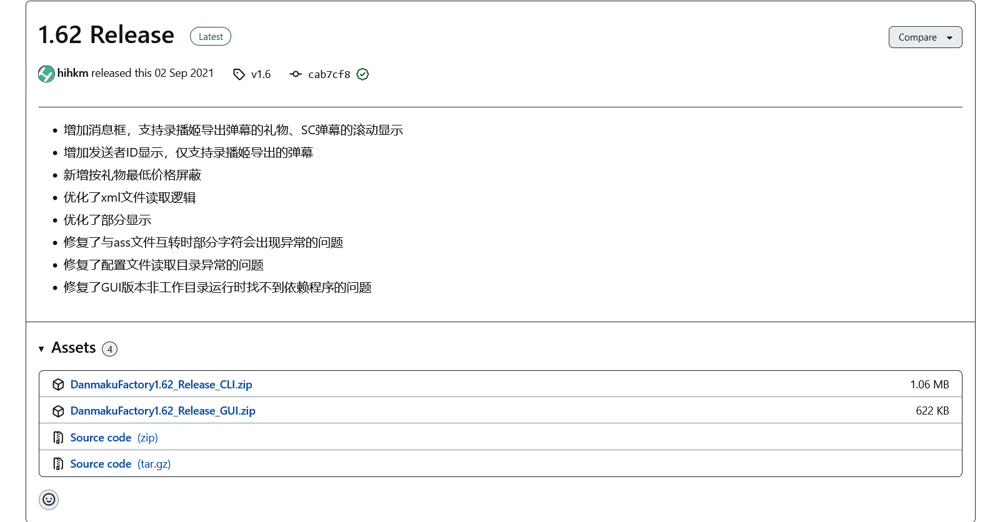
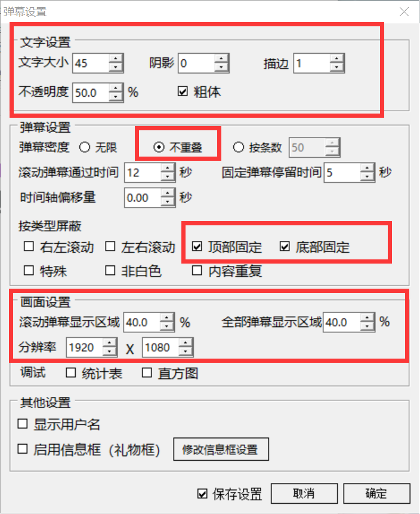

# 使用 DanmakuFactory 转换弹幕

!!! hint "小工具：我们可以再摆一些！🤞"
    我们编写了一个简易的批处理，打包了最新的 DanmakuFactory，方便你转换 XML 到 ASS。您可以戳 [这儿](./attachments/DanmakuFactory_with_Script.7z) 下载。
    
    所有的配置都已经默认按照本文配置构建，无需修改，拖 XML 到 bat 文件上，XML 源目录就能输出 ASS。
    
    脚本使用 思源黑体 作为弹幕的渲染字体，所以我觉得您也有可能需要 [装一个](https://mirrors.tuna.tsinghua.edu.cn/adobe-fonts/source-han-sans/SubsetOTF/CN/SourceHanSansCN-Bold.otf)。

---

## 下载 DanmakuFactory

GitHub：[hihkm/DanmakuFactory](https://github.com/hihkm/DanmakuFactory/releases/tag/v1.6)

-   本部分的内容需要用户界面，请下载第二个 GUI 版本。

## 配置 DanmakuFactory

>   配图来自 [@AS-N70](https://gitee.com/as-n70)，不胜感激

### 如果需要修改字体...

使用合适的编辑器，修改 `DanmakuFactoryGUIConfig.txt` 中 `fontname` 字段。将其改为字体的名字。

如脚本使用的字体 **思源黑体-粗** 即可写为：`SourceHanSansCN-Bold`