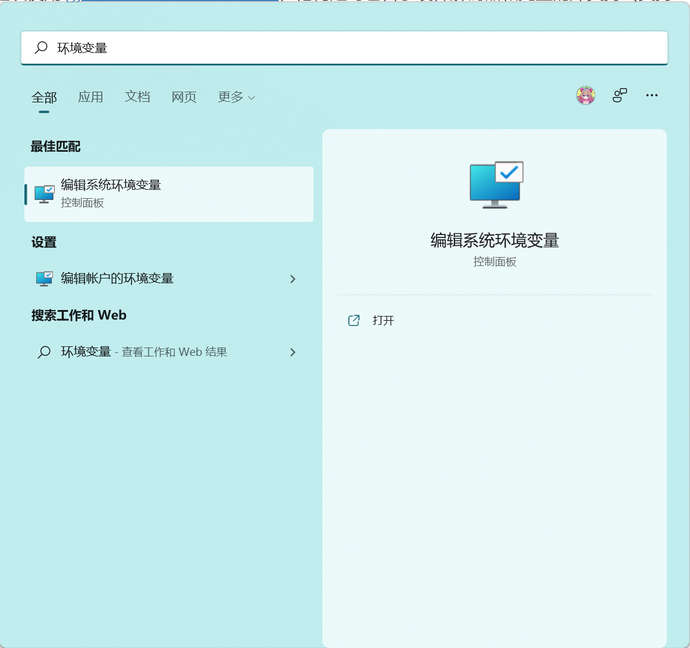
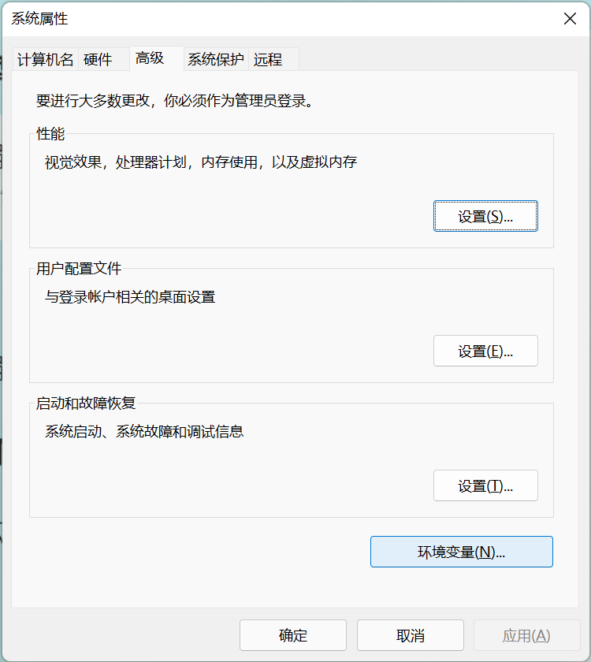

# 部署 FFMpeg 环境

>   FFmpeg 是一个开放源代码的自由软件，可以执行音频和视频多种格式的录影、转换、串流功能[6]，包含了libavcodec——这是一个用于多个项目中音频和视频的解码器库，以及libavformat——一个音频与视频格式转换库。
>
>   “FFmpeg”这个单词中的“FF”指的是“Fast Forward（快速前进）”。“FFmpeg”的项目负责人在一封回信中说：“Just for the record, the original meaning of "FF" in FFmpeg is "Fast Forward"...” 
>
>   
Souce: Wikipedia

---

​	之前提供的 HandBrake 是一个纯粹的压片用的软件——他不提供合并和录制的能力，也无法完成本文提出的一些特定任务，即便他引用了大量来自 FFMpeg 的代码作为支撑。产品设计不周情有可原，本文则为各位提供一份 FFMpeg 部署的不完全指南，并准备了一些基础的命令行命令来处理一些任务，作为补充。

​	当然，如果

## 获取 FFMpeg

-   Linux: 从发行版的包管理器获得。`apt install ffmpeg`
-   Windows: 建议使用 [gyan.dev 构建的最新完整版](https://www.gyan.dev/ffmpeg/builds/ffmpeg-git-full.7z)，他构建时包含了硬件解码器和完整的库支持（支持 NVIDIA 和 AMD）
-   macOS: `brew install ffmpeg`

## 为 Windows 安装 FFMpeg

-   下载 FFMpeg，解压到合适的路径（如：C 盘的特定目录）

-   搜索 “环境变量”

    

-   弹出的窗口点击 “环境变量”

    