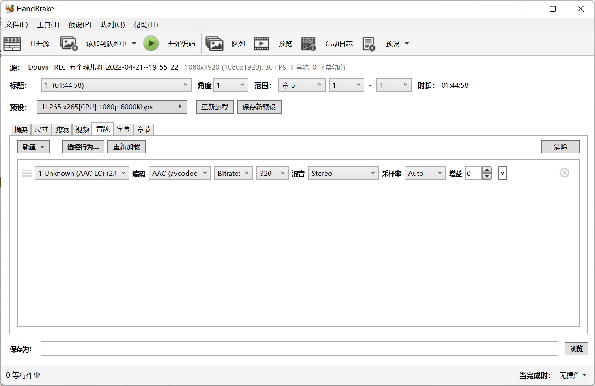

# 使用 HandBrake 压制视频

HandBrake 是一款开源软件，他支持将几乎所有格式的视频转换到目标格式，并支持使用 Intel/NVIDIA/AMD/Apple/高通 arm 设备的视频加速编码器，以加快编码过程。

官网：[https://handbrake.fr](https://handbrake.fr/)

---

## 使用预定义预设

这些预先定义的预设将大部分情况都涵盖了。默认采取的是 H.265(HEVC) 进行编码，可按需求自行调整。

您可以根据需求与硬件能力，在压制过程中可以参考使用这些预设。

| Intel QSV                                                    | NVEnc                                                        | CPU                                                          |
| ------------------------------------------------------------ | ------------------------------------------------------------ | ------------------------------------------------------------ |
| [4K 源片帧率](./attachments/qsv-4k.json)                     | [4K 源片帧率](./attachments/nvenc-4k.json)                   | [4K 源片帧率](./attachments/x265-4k.json)                    |
| [1080p 源片帧率](./attachments/qsv-1080.json)                | [1080p 源片帧率](./attachments/nvenc-1080.json)              | [1080p 源片帧率](./attachments/x265-1080p.json)              |
| [1080p 源片帧率 抖音竖屏源用](./attachments/qsv-1080-amemv.json) | [1080p 源片帧率 抖音竖屏源用](./attachments/nvenc-1080-amemv.json) | [1080p 源片帧率 抖音竖屏源用](./attachments/x265-1080p-amemv.json) |

---

## 自行定义配置

-   建议开启：
    -   网页优化 - 将重排 MP4 文件，便于审核与使用网盘等服务在线观看
    -   音视频起始对齐 - 可以改善时间戳问题导致的音画不同步
-   可选开启：
    -   保留常见元数据

-   需要修改：

    -   根据源视频的分辨率，选择适当分辨率

    -   如为抖音、录制抖音源等竖屏场景，需要改为“自定义”，并且扭转宽和高。（如 1080p 竖屏为 `1080*1920`）

        

-   余下的配置，除非您清楚正在做什么，否则没有必要修改。

-   需要修改：

    -   视频编码器

        -   根据制作过程中的实际情况，选择必要且合适的视频编码器。

    		!!! info "敬请参阅：建议 HEVC"
    		    建议您使用 HEVC 编码以获得最好的压缩比。一般的，显卡也对会 HEVC 进行优化，导出会更方便。

          	如果您没有相关硬件，相关的编码器不会展示。
        
         	 | 苹果 Mac （适用于 M1 芯片的 Mac 电脑） | AMD 显卡 （适用于核心显卡、APU 显示单元及独显） | NVIDIA 显卡 | Intel 显卡 （适用于核心显卡及 Xe 独显） | 处理器编码       |
         	 | ----------------------------------------- | --------------------------------------------------- | ----------- | ------------------------------------------ | ---------------- |
        	  | H.264 (VideoToolbox)                      | H.265 VCN                                           | H.264 NVENC | H.264 QSV                                  | H.264 x264       |
        	  | H.265 (VideoToolbox)                      | H.264 VCN                                           | H.265 NVENC | H.265 QSV                                  | H.265 x265       |
           | H.265 10bit (VideoToolbox)                |                                                     |             | H.265 QSV 10Bit                            | H.265 x265 10Bit |

    -   帧率如果不确定可以不做修改。一般适用 60。

        -   为了编码速度，可以考虑可变帧率。

    -   质量

        -   一般使用平均码率，请参阅下表综合考虑。
        
        -   建议 x264/x265 用户开启 2-Pass（二次编码） 以防止撕裂。
        
            | 上传源(3000Kbps)  | 哔哩哔哩压制-4K | 哔哩哔哩压制-1080P高码率/60FPS | 哔哩哔哩压制-1080P |
            | ----------------- | --------------- | ------------------------------ | ------------------ |
            | 4K 60FPS H.265    | 15903           | 4779                           | 2390               |
            | 4K 30FPS H.264    | 15916           | 4775                           | 2390               |
            | 1080P 60FPS H.265 | -               | 4778                           | 2390               |
            | 1080P 60FPS H.264 | -               | 4777                           | 2388               |

    -   编码器预设
        -   一般工作中会选择最快的那个（Speed/UltraSpeed）。
        -   如果活不急，可以用 Normal/Quality 这些高品质配置来压片。这样成片效果更好。

-   余下的配置，除非您清楚正在做什么，否则没有必要修改。

-   **必须调整**：
    -   比特率 320

-   余下的配置，除非您清楚正在做什么，否则尽量不要修改。

-   导入弹幕/字幕：
    -   轨道 -> 导入字幕 -> 选择文件
    -   ***勾选 Burn In（烧录）***

-   本页不影响 B 站投稿，没有调整的必要。
