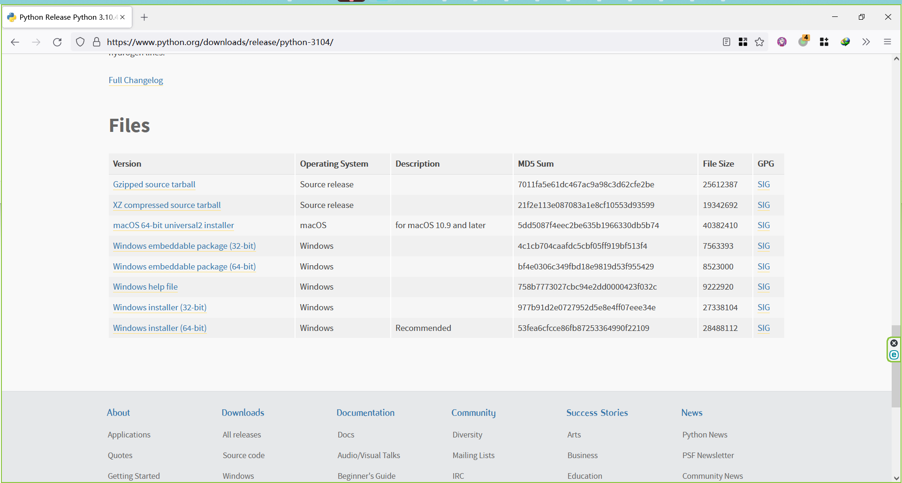
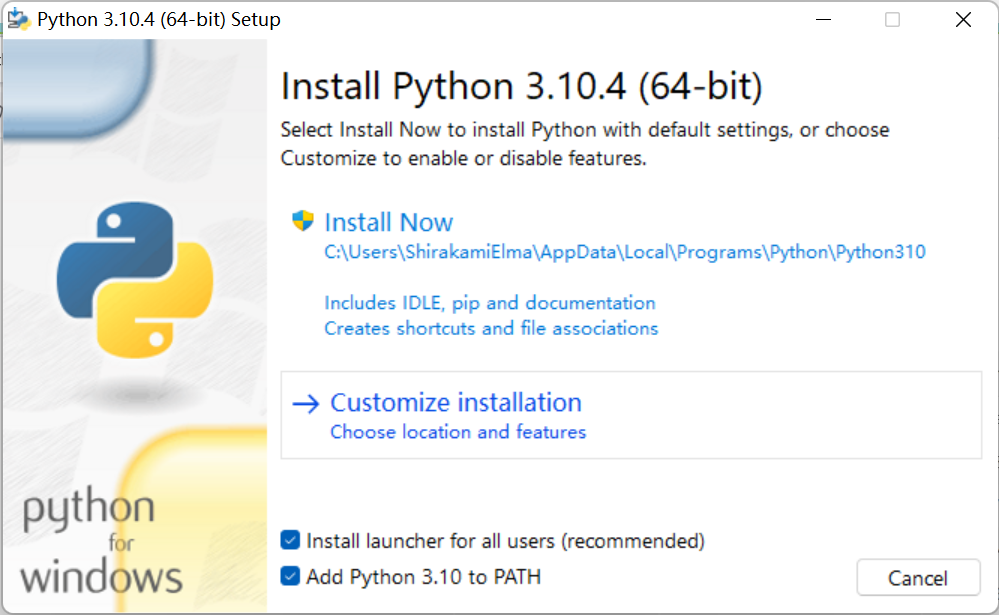
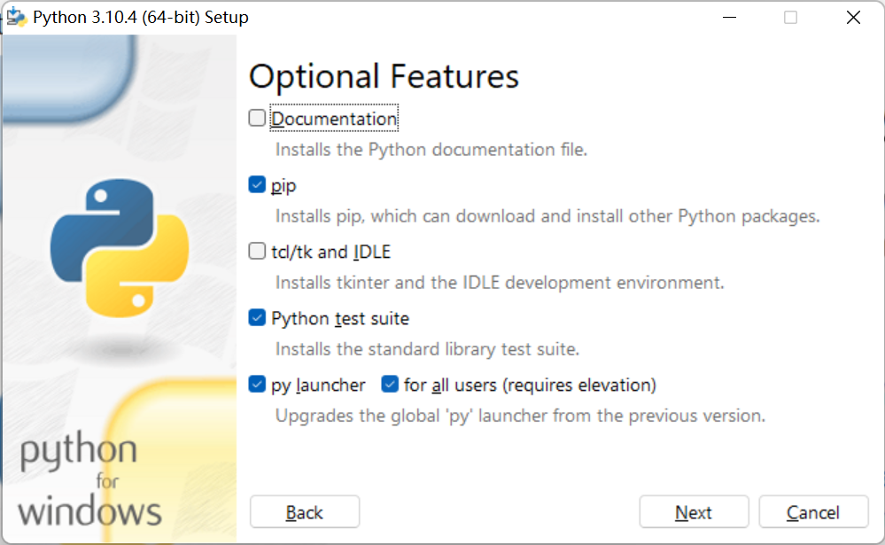
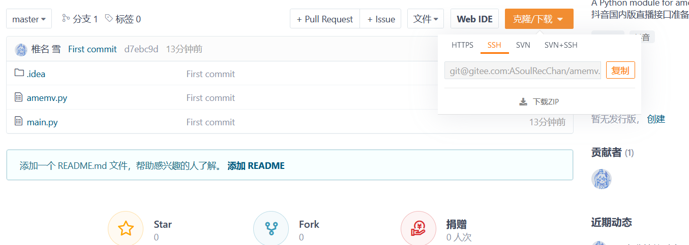
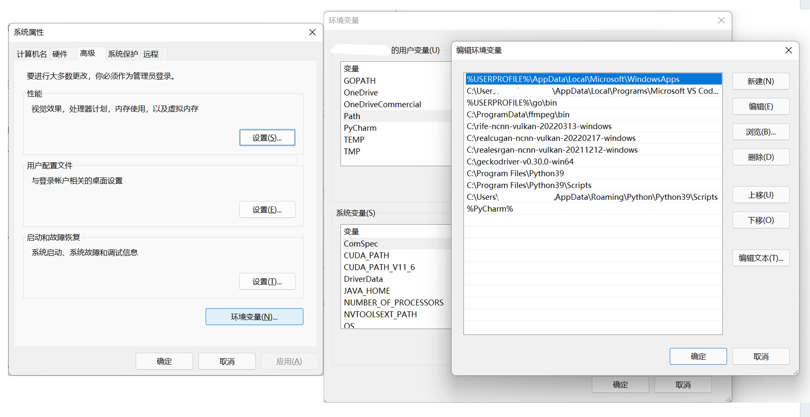
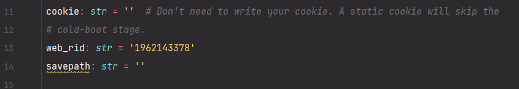

#  监听脚本

## 原理

-   使用 Python 先检测房间是否直播，如果直播就立刻录制；如果没有开播，则利用抖音开播更换 `room_id` 的机制，等待新的 `room_id`，如刷新视为开播。
-   使用 FFMpeg 录制。
-   使用 Selenium 调用浏览器获得 Cookies 以规避抖音后端风控。

## 使用

1.   配置 Python 环境。

     1.   下载 Python

          

     2.   打开安装器，选择 Customize installation

          

          

     3.   一路安装完成后退出。

2.   下载/克隆源代码

     

     下载 ZIP 或克隆后，打开终端/Powershell，进行如下操作。

3.   配置 pip 与必须软件包

```
python -m pip install -i https://pypi.tuna.tsinghua.edu.cn/simple --upgrade pip
pip config set global.index-url https://pypi.tuna.tsinghua.edu.cn/simple
pip install -r requirements.txt
```

4.   配置 GeckoDriver

     下载 [GeckoDriver](https://github.com/mozilla/geckodriver/releases) 并配置到环境变量。

     搜索 环境变量 然后打开 系统属性 -> 环境变量，把存放 GeckoDriver 的目录作为新的一行添加到 用户变量 - Path 里。
     
     

5.   安装 Firefox

     从 [这里](https://www.mozilla.org/zh-CN/firefox/all/#product-desktop-esr) 下载稳定版的 FireFox。

6.   修改脚本

     有 VSCode PyCharm 就用，没有用记事本编辑 `main.py`

     

     -   `savepath`：请填写存储录播的经过转义的**绝对路径**

         -   Linux：`/data/amemv/`

         -   Windows：`C:\\Users\\AvA\\Videos\\amemv-rec`

             **Windows 需要多一个反斜线**

     -   `cookie`：如果你能长期维护，且不需要 Selenium 帮你刷新 Cookie，你可以填入你自己的游客 Cookie。

         -   打开 live.douyin.com
         -   按下 F12，打开控制台
         -   输入`document.cookie`
         -   输出结果粘贴到此

     -   `web_rid`：抖音直播间链接的对外显示号码。1962143378 是五个女孩的直播间， 不需要修改。

7.   `python main.py` 观察输出。