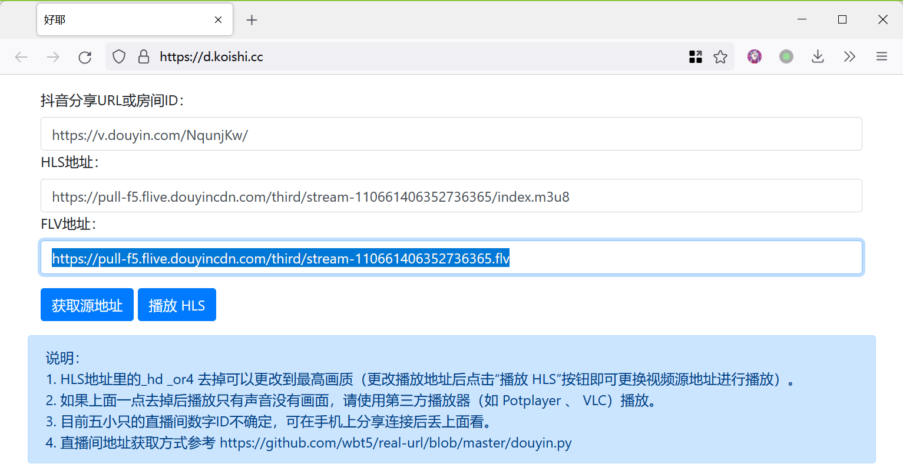
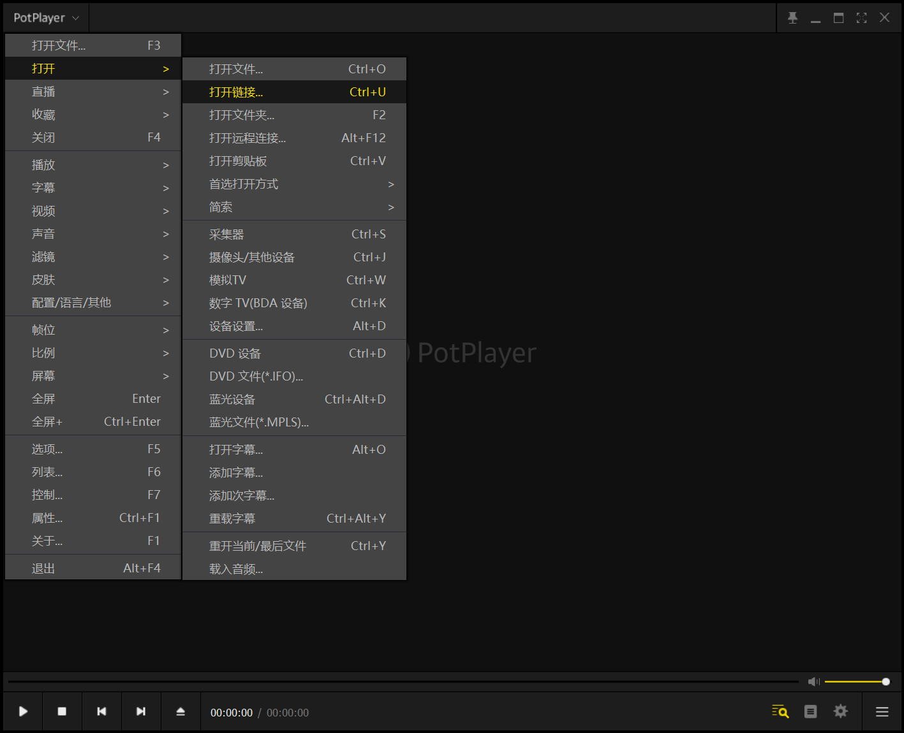
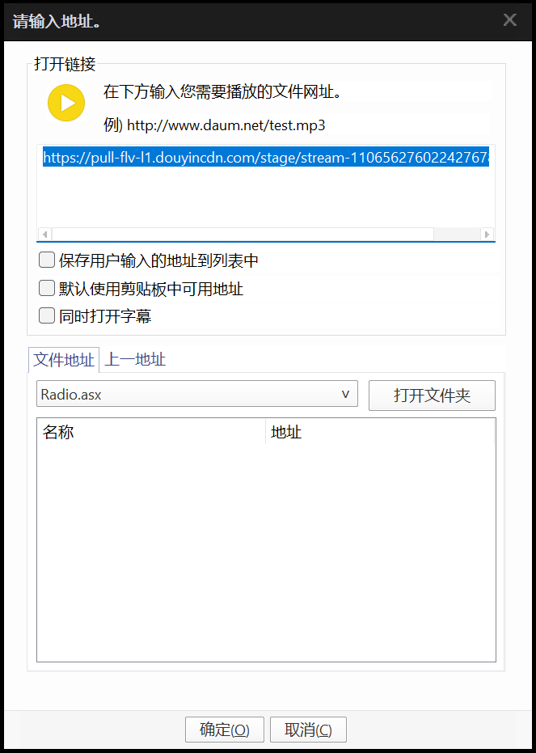

# 传统方法

!!! info "参考&鸣谢"
    本节引述自：[djj45/asoul](https://github.com/djj45/asoul)，并推荐使用了 kioshi.cc 的公共服务。
    
---
## 抓取地址

1. 在抖音直播间开播后分享房间 URL 留用

    

2. 打开 [在线抓流工具](https://gitee.com/link?target=https%3A%2F%2Fd.koishi.cc%2F)，粘贴分享 URL，复制 FLV 源的地址

    

## 录制直播流

### 使用播放器

!!! hint "敬请参阅：可替换工具"
        

    实际上，VLC 等能播放并录制 FLV 流的播放器都可以胜任这个任务，取决于你的偏好。
        
    录制抖音对于网络质量和稳定性是考验，建议保持良好的网络环境。

1.   打开软件，右键打开菜单，选择 `打开 -> 打开链接...`，在弹出的窗口粘贴复制的 FLV 地址

     

     

2.   点击确定播放后，继续打开菜单，选择 `视频 -> 视频录制 -> 保存流...`

3.   选择存储格式为 FLV，按时间中止。

     参考时间如下：

     | 直播情况   | 预计时间  |
     | ---------- | --------- |
     | 嘉然单播   | ≥ 50 分钟 |
     | 其他人单播 | ≥ 60 分钟 |
     | 团播       | ≥ 70 分钟 |

     实际使用的时间可以更长——PotPlayer 在没有流输出后应该会正确的中断，不会继续写入。

4.   直播结束后，右键打开菜单，选择 `视频 -> 视频录制 -> 保存流...`，点击 `停止`

### 使用 ffmpeg

1.  请确认你正确配置了 FFMpeg 环境

2.  复制、修改如下代码，粘贴到终端运行：

    ```
    ffmpeg -i [直播 FLV 源链接] -c copy [文件名].flv
    ```

    如果抖音的流中断或发生网络波动，你需要修改文件名（比如添加 `-1` 标记）重新运行命令。
