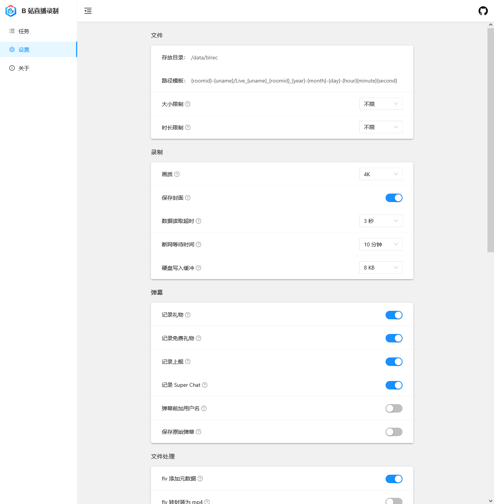
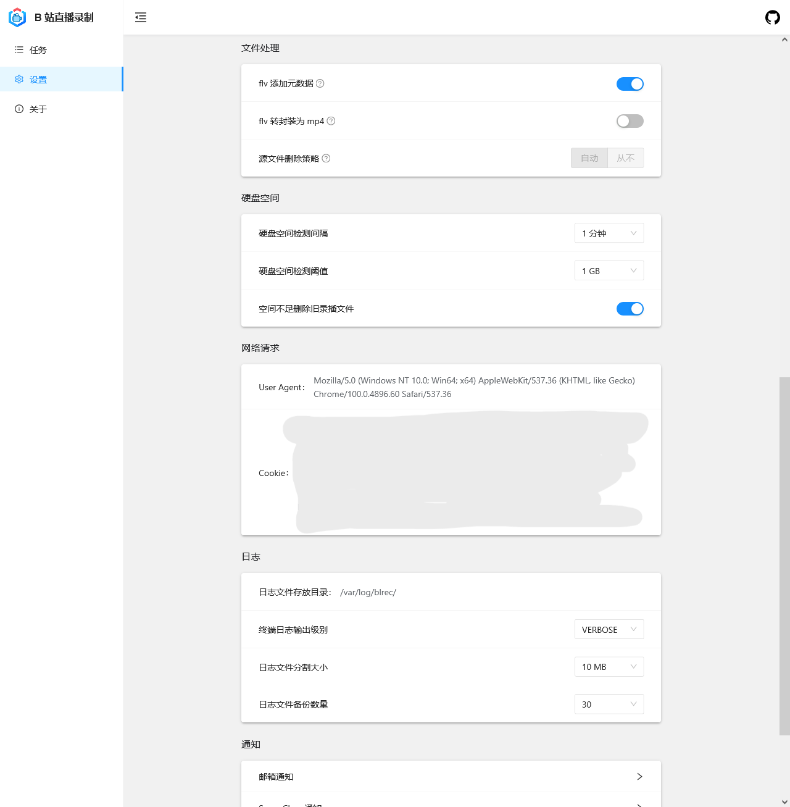
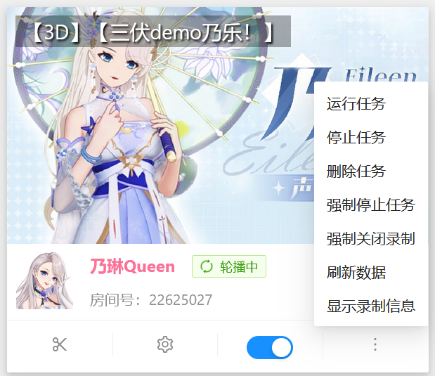
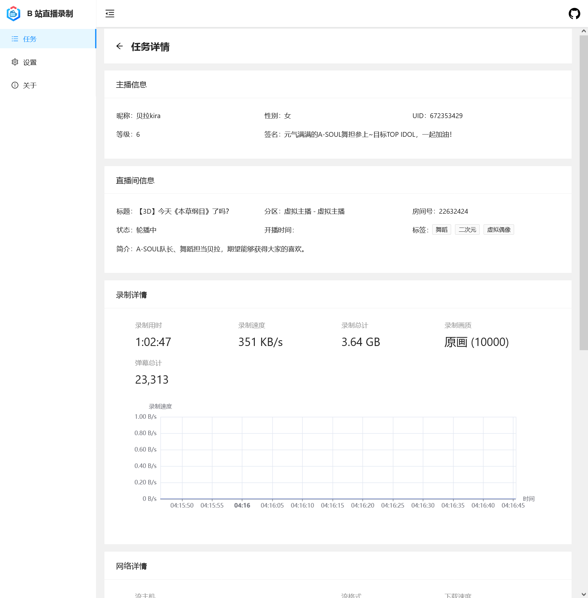
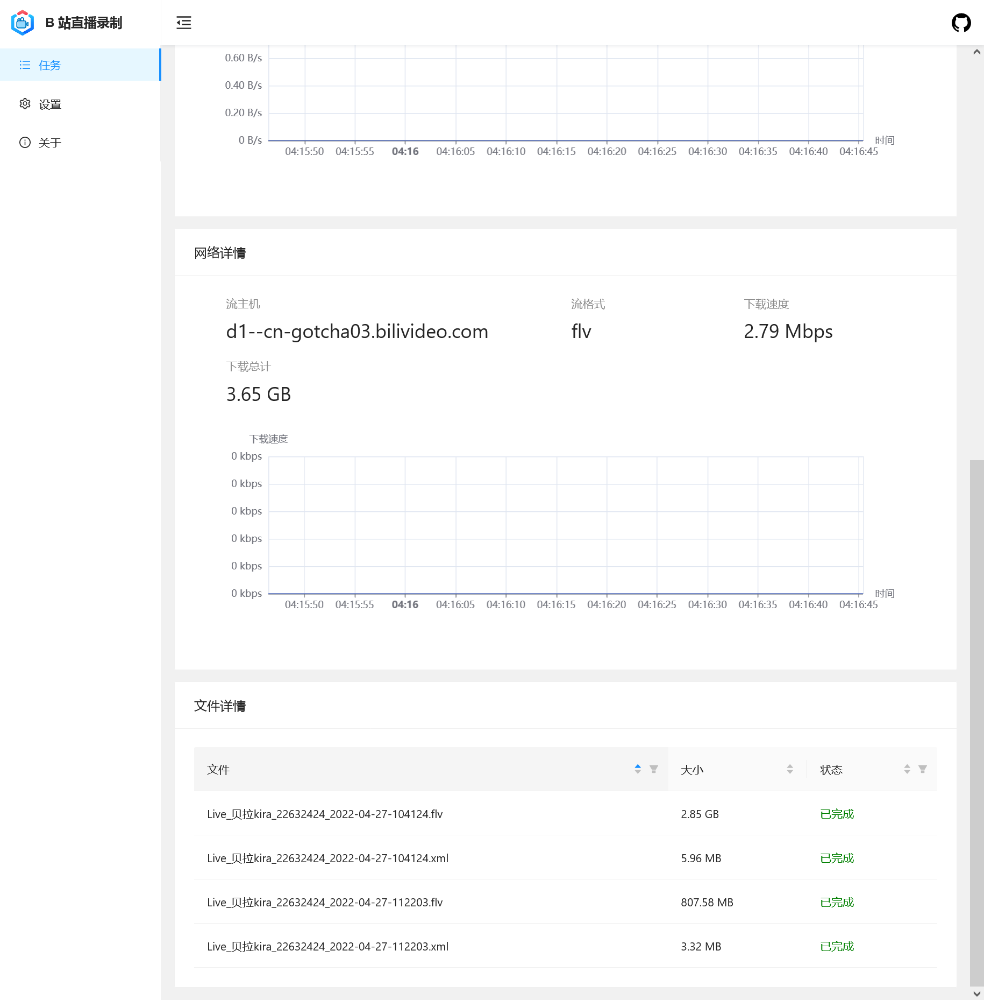

# 使用 acgnhiki/blrec 项目

!!! info "另请注意：可能不符合您的情况😺"

    这里前半部分可能对你来说没有什么意义捏... 
    
    你可以用目录直接跳到需要的部分哦！

## 安装 blrec

### 一些简单的运行办法...

#### Docker

-   环境变量

    -   默认设置文件位置: `ENV DEFAULT_SETTINGS_FILE=/cfg/settings.toml`

    -   默认日志存放目录: `ENV DEFAULT_LOG_DIR=/log`

    -   默认录播存放目录: `ENV DEFAULT_OUT_DIR=/rec`

-   默认参数运行

```
sudo docker run -v /etc/blrec:/cfg -v /var/log/blrec:/log -v ~/blrec:/rec -dp 2233:2233 acgnhiki/blrec
```

-   命令行参数用法

```
sudo docker run \
    -v /etc/blrec:/cfg -v /var/log/blrec:/log -v ~/blrec:/rec \
    -dp 2233:2233 acgnhiki/blrec \
    -c /cfg/another_settings.toml \
    --key-file path/to/key-file \
    --cert-file path/to/cert-file \
    --api-key bili2233
```

#### Windows 绿色版

Windows 64 位系统用户也可以用打包好的免安装绿色版，下载后解压运行 `run.bat` 即可。

免安装绿色版

-   下载并解压新版本
-   确保旧版本已经关闭退出以避免之后出现端口冲突
-   把旧版本的设置文件 `settings.toml` 复制并覆盖新版本的设置文件
-   运行新版本的 `run.bat`

### 配置 Python 环境

这段命令参考是针对 Debian/Ubuntu 及衍生发行版的。其他的发行版差异也不大。

如果您用 Windows，您可以前往官网下载安装。安装前可以勾选所有的勾——他们应该是不会伤害你的操作系统。

如果您用其他发行版，我猜您应该会装 :)
```bash
sudo apt update && apt dist-upgrade
sudo apt install python-is-python3 python3 build-essential ffmpeg
```

正确配置 Python 环境后，如下命令仅供参考，适合所有发行版。

如果您是 Windows，作者表明有些库需要编译，因而可能需要您安装 MS C++ 构建工具。

详请参阅：https://github.com/acgnhiki/blrec
```bash
python -m pip install -i https://pypi.tuna.tsinghua.edu.cn/simple --upgrade pip
pip config set global.index-url https://pypi.tuna.tsinghua.edu.cn/simple
pip install blrec
```


## 配置 blrec

!!! info "敬请留意：存储策略"
    我推荐您使用 “固态转存机械” 或 “固态定期转存云端存储” 的策略，能够有效避免存储时遇到可能的不稳定与低速问题。
    
    您可以用 rclone 对接 Google Drive 或 OneDrive for Business 来节约成本、方便分享，亦可使用各大云盘厂商提供的应用程序自带的同步功能。
    
    同时，如果您使用个人电脑进行录播，不建议您在本地保留过多的录播数据，以免对未来使用和日常生活造成影响。
    
    先要好好吃饭，再来好好看直播，然后才是一起录播和轻松愉快的二创。






## 使用 blrec

### 缩略图



其中：

-   剪刀按钮：从此刻截断录播，生成新的录播文件——二刀流常用

-   齿轮按钮：针对这个直播间，调整特定的录播参数——如果您运行的不是 DD 录播机，您大概也不需要调整。

-   开关：启用/停止这个直播间的录播。正在进行的任务会被结束。

-   更多：

    -   刷新数据：重新获取房间状态，多用于显示错误。
    -   显示录制信息：显示录播情况的图表

-   点击封面：可进入详情页，对直播录播情况进行检查。

    


