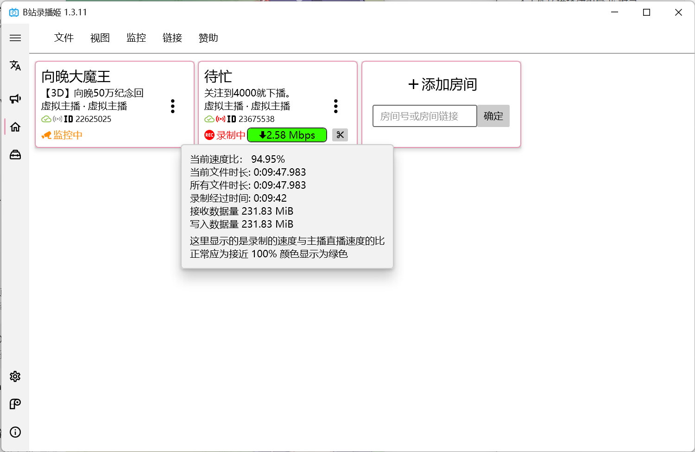
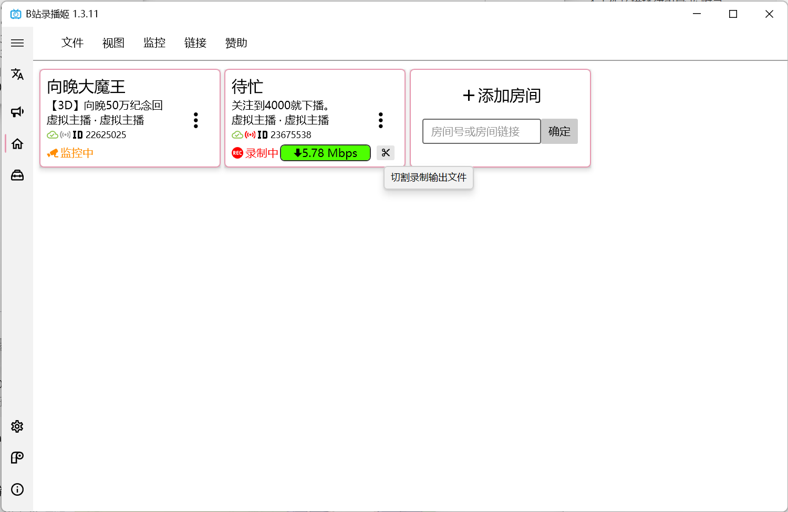

# 使用 哔哩哔哩录播姬

!!! info "敬请留意：存储策略"
    我推荐您使用 “固态转存机械” 或 “固态定期转存云端存储” 的策略，能够有效避免存储时遇到可能的不稳定与低速问题。
    
    您可以用 rclone 对接 Google Drive 或 OneDrive for Business 来节约成本、方便分享，亦可使用各大云盘厂商提供的应用程序自带的同步功能。

    同时，如果您使用个人电脑进行录播，不建议您在本地保留过多的录播数据，以免对未来使用和日常生活造成影响。
    
    先要好好吃饭，再来好好看直播，然后才是一起录播和轻松愉快的二创。

1.  从 [录播姬官网](https://gitee.com/link?target=https%3A%2F%2Frec.danmuji.org) 下载录播姬最新的安装包，双击后即安装到操作系统。

2.  选择合适的 **空文件夹** 存储录播。我们建议您优先选择存储在固态硬盘后转移的策略。

    

3.  添加 A-SOUL [五个账号的直播间 ID](https://gitee.com/ASoulRecChan/WorkGuide/blob/dev/index.md###成员基础信息)

4.  参照下图进行录播机基础配置

    

    -   视频分段时间如有变化以群内再次商定的时间为准。

5.  请在开播一段时间之前保持录播姬始终开启，并在此期间尽可能保证录播用电脑的网络环境相对稳定。

    您可以点击带颜色的指示器来获得详细的速度提示。

    

    -   如果您负责二刀流：

        请在您认为合适的 **开始和结束** 时间点击 ”剪刀“ 图标。录播姬会在不打断录播的前提下分割录播文件。

        

    

    !!! warning "您需要知道的情况..."

        哔哩哔哩直播 现在可能存在向观众提交画面时暗砍码率的问题。不管主播推流的码流多高，都会被强行压缩到大果粒水平。此时的录播姬即使速度比保持正 99% 左右也无法保证录播的画质。
        
        正常情况下的原画录播应该保持在 9.5Mbps ~ 11Mbps 区间。为保证录播质量，如果你的录播姬速率始终保持在 5Mbps ~ 1Mbps 区间，请及时和群内小伙伴复核文件大小和时长。如存在录播尺寸明显过小、大量无法修正的断流，请尽快地交接当前任务给其他速率正常的小伙伴。
        
        在近期的工作中，录播仍旧偶发降速、断线——原因详细是什么我暂且蒙在古包里。
        
        细心的朋友也会发现，我正在截图的时候速率也处于被限速状态，哈哈。😄