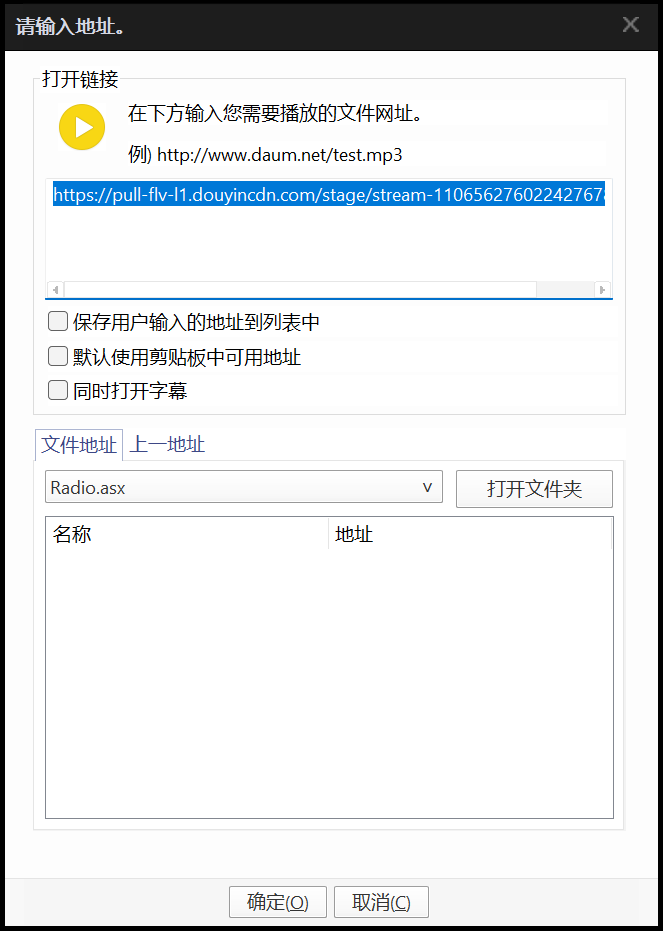

# A-SOUL 录播组协作指北

​	*最后一次更新：2022/04/038

​	*更新内容：第一次版本大改后添加`amemv`抓流。<br>指引文件于尝试阶段，恳请各位理解。*

---

[TOC]

---

## 0 前言

​	感谢您参与 A-SOUL 录播姬的协同工作流程，请您在参与工作流程之前按需仔细阅读本文档。这是一份内部工作指引文档，尽管如此，您仍然可以以非商业的目的及无授权的形式任意取用。

​	如果文章存在问题，或您希望改进，您可以在本仓库提交 Pull Request / Issue，或者联络群主及相关负责人。

### 授权

​	本组使用、引用的图片/工具/开源项目之 License 以相关作者/组织声明为准，并受到相关条款约束；原创内容以 WTFPL 授权给所有用户。

```
            DO WHAT THE FUCK YOU WANT TO PUBLIC LICENSE
                    Version 2, December 2004

 Copyright (C) 2004 Sam Hocevar <sam@hocevar.net>

 Everyone is permitted to copy and distribute verbatim or modified
 copies of this license document, and changing it is allowed as long
 as the name is changed.

            DO WHAT THE FUCK YOU WANT TO PUBLIC LICENSE
   TERMS AND CONDITIONS FOR COPYING, DISTRIBUTION AND MODIFICATION

  0. You just DO WHAT THE FUCK YOU WANT TO.
```

## 1 协同工作须知

​	为保证沟通与工作顺利，投入工作前，需要您知悉如下作业须知：

### 沟通与分工

> 太长不看版：
>
> - 保持良性沟通 
> - 出问题及时报备
> - 协调好节奏，不要抢活或架空某个任务
> - 能者多劳，会者不难:hand:

- 请 **尽量不要** 同时操作同一个稿件，以防止不能保存、稿件重复、触发 B 站风控的情况产生。

- 工作群长期处于禁言状态，仅在工作流程准备、工作流程结束两个阶段之间允许发言。

  - 尽管如此，也请您及时和相关负责人尽早建立联系，并在遇到无法完成任务的情况时及时沟通。

  - 如果您遇到了无法完成手头工作的情况，请及时和群主或其他群有联系交替。

    同时，如果您的计算条件、网络条件、可支配时间相对充足，也欢迎您申报应急负责人。
    
    ---
    
    | 分工     | 负责人                                                 |
    | -------- | ------------------------------------------------------ |
    | 弹幕录播 | 椎名雪 / 契卡 / 堪折                                   |
    | 封面     | 契卡                                                   |
    | 团播     | 五十八方                                               |
    | 单播     | Choa                                                   |
    | 切片     | 贝极星汉灿烂 二刀流歌舞节目 自行投稿                   |
    | 切片     | 贝贝笨极星 二刀流 提交到群组                           |
    | 切片     | 落神 处理节目爆点和小包袱 自行投稿                     |
    | 换源     | 煎饼静子 即时歌舞切片并换源                            |
    | 应急处置 | 椎名雪 / 贝极星汉灿烂 根据当前任务，尽可能处置退回锁定 |

### 录播注意事项

- 尽量不要过早停止录播，预防回马枪丢录
- 尽可能始终保持你的录播机运行——如果你的网络不按量计费且条件较好。

### 切片注意事项

- 二刀流时尽可能流出足够的提前量
- 请参考附录的 ”标准标题&简介模板“
- 精简需保证时效，尽可能在两天内的直播中切片，避免零散投稿。<br>如果质量拿不准可以发到群里让大家检查。尽量避免摆烂切片，宁缺毋滥。
- 切片者如无账号权限，则发到群里告知有权限的组员操作

### 账号使用事项

- 登录账号请使用 Chrome 的多用户特性，或 FireFox 的 用户容器 特性（嫌麻烦可以使用独立的浏览器），将组号独立储存在单独的会话中，尽量不要退出或清除浏览器数据。
- 提及的二创转发请尽可能符合大众审美，不要过于非主流~~畜生~~引起不适，亦需要把控转发频率，以免打扰粉丝。
- 固定的组号权限不转让，登录尽可能使用邮箱密码。触发风控及时联系组长。

## 2 特定工作引导

### 录播

​	这一部分将阐述两个平台的录播方式，并提供相关工具的下载指导。

#### 抖音源

>  另请留意：
>
>  ​	可以使用 Python 模块来获取最新的 room_id 和直播流链接，无需再开启抖音。
>
>  ​	组内使用的自动一体录播姬还在写，别急，难的不会:wave:
>
>  ​	五个女孩的直播间 `web_rid` = `1962143378`
>
>  ​	参考用例：
>
>  ```python
>  # 我假装你正确的安装了依赖，并且设置好了 GeckoDriver 的环境变量；
>  # 我也假装你装好了最新的火狐。
>  
>  import amemv
>  room_id = amemv.PullroomID( web_rid = "1962143378" )
>  print(amemv.RequestInformation( id = "rtmp_pull_url", room_id ))
>  ```
>
>  ​	可直接复制到 Python 终端使用。

​	

> 本节引述自：[djj45@Gitee/asoul]([录播.md · 志摩凛/asoul - Gitee.com](https://gitee.com/djj45/asoul/blob/master/录播.md#potplayer录播参考豆瓣帖子))，并推荐使用了 kioshi.cc 的公共服务。
>
> 对原作者的整理及服务提供者表示感谢。
>
> ---
>
> 您需要准备：
>
> - 抖音 APP
> - 浏览器
> - PotPlayer 或 FFMpeg 环境

1. 在抖音直播间开播后分享房间 URL 留用

   

2. 打开 [在线抓流工具](https://d.koishi.cc/)，复制 FLV 源的地址

   

3. 参阅如下步骤：

##### 使用 PotPlayer

> 实际上，VLC 等能播放并录制 FLV 流的播放器都可以胜任这个任务，取决于你的偏好。
>
> 录制抖音对于网络质量和稳定性是考验，建议保持良好的网络环境。

1. 打开软件，右键打开菜单，选择 `打开 -> 打开链接...`，在弹出的窗口粘贴复制的 FLV 地址

    

2. 点击确定播放后，继续打开菜单，选择 `视频 -> 视频录制 -> 保存流...`

3. 选择存储格式为 FLV，按时间中止。

   参考时间如下：

   | 直播情况   | 预计时间  |
   | ---------- | --------- |
   | 嘉然单播   | ≥ 50 分钟 |
   | 其他人单播 | ≥ 60 分钟 |
   | 团播       | ≥ 70 分钟 |

   实际使用的时间可以更长——PotPlayer 在没有流输出后应该会正确的中断，不会继续写入。

4. 直播结束后，右键打开菜单，选择 `视频 -> 视频录制 -> 保存流...`，点击 `停止`

##### 使用 FFMpeg

1. 请确认你正确配置了 FFMpeg 环境

2. 复制、修改如下代码，粘贴到终端运行：

   ```shell
   ffmpeg -i [直播 FLV 源链接] -c copy [文件名].flv
   ```

   如果抖音的流中断或发生网络波动，你需要修改文件名（比如添加 `-1` 标记）重新运行命令。

#### 哔哩哔哩源

​	本节包含两个工具的使用。

##### 录播工具比较

|                             | 录播姬 | blrec | 备注                                                         |
| --------------------------- | ------ | ----- | ------------------------------------------------------------ |
| 断流及碎片修正              | ×      | √     | blrec 的几乎无缝录播能且只能解决主播侧或直播线路投送时的断流，似乎对录制侧的问题无能为力。 |
| 基础录制（弹幕、高清流）    | √      | ？    | 截至 2022/04/03 测试，blrec 似乎对于 B 站的高码率直播不能很好处理，已同开发者反馈。 |
| 自动切割（分时、分大小）    | √      | √     | blrec 存在分割精度低、无法自定时间的现象。                   |
| 对于收费/限定直播的录制能力 | ？     | √     | 如有付费直播，需要设置购买了直播门票的账号 Cookies。<br>详细操作请参阅本文档的附录。 |
| 推送消息                    | ？     | √     | 尽管录播姬提供了 WebHook 能力，但上手难度大，需要自行对接服务；<br>blrec 内建 ServerChan 和 PushPlus 两个推送服务，也内建发送邮件推送和WebHook能力。 |
| 网页面板                    | ×      | √     | 录播姬开发者说 ”计划添加“ ~~没发就是咕咕~~<br>在此建议使用 VPS 或本地无头主机的用户暂时使用 blrec 项目。 |
| 跨系统能力                  | √      | √     | 其中 blrec 在 *nix 环境下需要正确配置 Python<br>录播机在定稿之时尚未出现网页面板，亦无 GUI。不适合 *nix 用户。 |

---

##### 哔哩哔哩录播姬

1. 从 [录播姬官网](https://rec.danmuji.org) 下载录播姬最新的安装包，双击后即安装到操作系统。

2. 选择合适的 **空文件夹** 存储录播。我们建议您优先选择存储在固态硬盘后转移的策略。

   

3. 添加 A-SOUL [五个账号的直播间 ID](###成员基础信息)

4. 参照下图进行录播机基础配置

   

   - 视频分段时间如有变化以群内再次商定的时间为准。

5. 请在开播一段时间之前保持录播姬始终开启，并在此期间尽可能保证录播用电脑的网络环境相对稳定。

   您可以点击带颜色的指示器来获得详细的速度提示。

   

   - 如果您负责二刀流：

     请在您认为合适的 **开始和结束** 时间点击 ”剪刀“ 图标。录播姬会在不打断录播的前提下分割录播文件。

     

   >敬请留意：
   >
   >​	哔哩哔哩直播 现在可能存在向观众提交画面时暗砍码率的问题。不管主播推流的码流多高，都会被强行压缩到大果粒水平。此时的录播姬即使速度比保持正 99% 左右也无法保证录播的画质。
   >
   >​	正常情况下的原画录播应该保持在 9.5Mbps ~ 11Mbps 区间。为保证录播质量，如果你的录播姬速率始终保持在 5Mbps ~ 1Mbps 区间，请及时和群内小伙伴复核文件大小和时长。如存在录播尺寸明显过小、大量无法修正的断流，请尽快地交接当前任务给其他速率正常的小伙伴。
   >
   >---
   >
   >​	目前有且只有开播前保持监听的录播姬才能正常获得正常的 “原画” 流，其他录播项目或多或少的存在无法正确获得原画流的现象，速度始终稳定低于 3Mbps ——原因详细是什么我暂且蒙在古包里。
   >
   >​	细心的朋友也会发现，我正在截图的时候速率也处于被限速状态，哈哈。😄

---

##### acgnhiki/blrec

**笔者暂不推荐使用 blrec 项目进行录播。可能存在一定程度的速度不正常现象，且配置难度较大。**

###### 绿色版配置

1. 下载 blrec 绿色版（当前最新版 [1.5.0](https://github.com/acgnhiki/blrec/releases/tag/v1.5.0)）

   

2. 解压后运行 `run.bat`。

3. 浏览器访问 http://127.0.0.1:2233

###### 服务器/非 Windows 下的设置

```	bash
# 这段命令参考是针对 Debian/Ubuntu 及衍生发行版的。其他的发行版差异也不大。
sudo apt update && apt dist-upgrade
sudo apt install python-is-python3 python3 build-essential ffmpeg

# 正确配置 Python 环境后，如下命令仅供参考，适合所有发行版。
python -m pip install -i https://pypi.tuna.tsinghua.edu.cn/simple --upgrade pip
pip config set global.index-url https://pypi.tuna.tsinghua.edu.cn/simple
pip install blrec
```

###### 参考的 blrec 参数设定


###### Cookies 提取与设定

> ***请您注意：Cookies 是您在 哔哩哔哩 如同 账号密码+短信验证码 的凭据。<br>请务必 不要 将这些信息分享给他人，并尽可能使用低价值的小号进行付费录播工作。***
>
> 如您有组号的权限，也请不要使用组号的 Cookies 配置录播
>
> 配置无论是单直播间还是全局的 Cookies 均需要重启弹幕获取客户端，因此请确保当前无录播再进行操作。

1. 打开浏览器的 哔哩哔哩直播 网页
2. 按下 F12 打开 ”开发人员选项“
3. 选择 Console / 控制台
4. 输入 `document.cookie`，确认回车
5. 右键复制出现的一长串文本
6. 前往 设置 -> 网络请求 -> Cookie 下粘贴这个字符串。如果遇到了双引号（多发于 FireFox），还请删除。

### 压制

#### 使用 HandBrake

​	HandBrake 支持 Intel/AMD/NVIDIA 的硬件加速解码。对于追求快速压制并且不想折腾 FFMpeg 的朋友可以参考使用。可以在[这里](https://handbrake.fr/downloads.php)下载到。

​	您可以自行配置，亦可从 附录 下载到已经配置好的预设。

##### 配置预设

###### 导入成品预设

- 打开 HandBrake，选择源 界面点击 取消；

- 预设 -> 从文件导入 -> 选择下载的预设 JSON 文件
- 从 A-SOUL RECORDING ENCODE 分类选择合适的编码配置

###### 手动配置预设

- 摘要 建议配置：

  - 格式 MP4

  - 网页优化 - 勾选

  - 音视频起始对齐 - 勾选

  - 保留常见元数据 - 按需

- 尺寸 建议设置：

  - 分辨率限制：按需

  - 其他参数：按需

- 滤镜 按需设置。

- 视频 建议设置：

  - 视频编码器：
    - 一般建议选择 H.265，编码性能更高。
    - 建议选择 显卡加速 的编码器（Intel QSV / NVIDIA NVEnc / AMD VCE）

  - 帧率：
    - 60 / 120 FPS 按需选择。
    - 建议选择峰值帧率，加快编码速度

  - 质量：

    - 建议参照下表进行平均编码数值评估：

      | 上传源(3000Kbps)  | 哔哩哔哩压制-4K | 哔哩哔哩压制-1080P高码率/60FPS | 哔哩哔哩压制-1080P |
      | ----------------- | --------------- | ------------------------------ | ------------------ |
      | 4K 60FPS H.265    | 15903           | 4779                           | 2390               |
      | 4K 30FPS H.264    | 15916           | 4775                           | 2390               |
      | 1080P 60FPS H.265 | -               | 4778                           | 2390               |
      | 1080P 60FPS H.264 | -               | 4777                           | 2388               |

      *太长不看：4K 源压制约 15900-16000；1080P 源压制约 4800-5000*

    - 如使用处理器编码，建议选择 二次编码。

- 音频、章节 无需设置。

- 字幕 
  - 根据实际情况导入 ASS 字幕/弹幕，忽略 语言，直接勾选 Burn-In（烧录）即可。 

#### 弹幕转换

##### 使用 批量转换脚本（基于 DanmakuFactory)

​	脚本可以在[这里](./attachments/DanmakuFactory-Scripts.7z)下载到。直接将带有 .xml 弹幕文件的文件夹 / 文件拖动到批处理文件上，批处理会自动识别转换。

##### 使用 DanmakuFactory GUI

1. 你可以在[这里](https://github.com/hihkm/DanmakuFactory/releases/download/v1.6/DanmakuFactory1.62_Release_GUI.zip)下载到官方版的 DanmakuFactory。

2. 可以在解压后直接创建 `DanmakuCactoryGUIConfig.txt` 文件到 DF 目录下。

3. 可以参考如下配置，直接替换

   ```
   DanmakuFactoryConfigVer:1.0;
   resX:1920;resY:1080;
   displayarea:0.4;
   scrollarea:0.4;
   scrolltime:12;
   fixtime:5;
   density:-1;
   fontname:Microsoft YaHei;
   fontsize:45;
   opacity:128;
   outline:1;
   shadow:0;
   bold:True;
   blockR2L:False;blockL2R:False;blockTop:True;blockBtm:True;blockSpecial:False;blockColor:False;blockRepeat:False;
   statTable:False;statHistogram:False;
   showUsernames:False;
   showMsgbox:False;
   msgboxPosX:10;msgboxPosY:0;
   msgboxSizeWidth:500;msgboxSizeHeight:1080;
   msgboxFontsize:35;
   giftMinPrice:0;
   ```

   其中字体可以选择性更换为 汉仪旗黑（`HYQiHei-75W`）、思源黑体（`SourceHanSansCN-Bold`）

4. 打开主界面，输入需要转换的文件，点击转换即可。

#### 弹幕的再处理

##### 文本编辑器大法

​	用 记事本 或 任何文本编辑器 打开生成的 .ass 文件，替换 `[V4+ Styles]` 部分如下：

```ass
[V4+ Styles]
Format: Name, Fontname, Fontsize, PrimaryColour, SecondaryColour, OutlineColour, BackColour, Bold, Italic, Underline, StrikeOut, ScaleX, ScaleY, Spacing, Angle, BorderStyle, Outline, Shadow, Alignment, MarginL, MarginR, MarginV, Encoding

Style: R2L,SourceHanSansCN-Bold,45,&H7FFFFFFF,&H00FFFFFF,&H00000000,&H1E6A5149,1,0,0,0,100.00,100.00,0.00,0.00,1,0.4,0,8,0,0,0,1
Style: L2R,SourceHanSansCN-Bold,45,&H7FFFFFFF,&H00FFFFFF,&H00000000,&H1E6A5149,1,0,0,0,100.00,100.00,0.00,0.00,1,0.4,0,8,0,0,0,1
Style: TOP,SourceHanSansCN-Bold,45,&H7FFFFFFF,&H00FFFFFF,&H00000000,&H1E6A5149,1,0,0,0,100.00,100.00,0.00,0.00,1,0.4,0,8,0,0,0,1
Style: BTM,SourceHanSansCN-Bold,45,&H7FFFFFFF,&H00FFFFFF,&H00000000,&H1E6A5149,1,0,0,0,100.00,100.00,0.00,0.00,1,0.4,0,8,0,0,0,1
Style: SP,SourceHanSansCN-Bold,45,&H00FFFFFF,&H00FFFFFF,&H00000000,&H1E6A5149,1,0,0,0,100.00,100.00,0.00,0.00,1,1,0.4,7,0,0,0,1
Style: message_box,SourceHanSansCN-Bold,38,&H00FFFFFF,&H00FFFFFF,&H00000000,&H1E6A5149,1,0,0,0,100.00,100.00,0.00,0.00,1,1,0,7,0,0,0,1
```

##### AegiSub 修改法

​	用 AegiSub 打开生成的 .ass 文件，全选 - 编辑 - 边框 - 0.4

### 切片

#### 歌舞切片

- 可以使用 MusicTools 或能下载 LRC 歌词文本的音乐平台/工具，按照歌名下载歌词
- 可以使用 LrcToSrt 等转换器将 LRC 歌词转换成 SRT 字幕文件，方便 AegiSub 再处理。
- 可以使用 FFMpeg 或 HandBrake 压制歌舞字幕。
- 建议使用 AegiSub 处理字幕。

---

1. 使用您准备的工具，根据歌名下载 LRC 歌词，并转换为 SRT 文件
2. 将字幕导入 AegiSub，按照如下流程操作:
   - 颜色：白色
   - 描边：应援色（参考 [附录 - 成员基础信息](##成员基础信息)）
   - 位置：左下角，应当保持在安全线位置，保持一定间距。
3. 将字幕保存，参照 [使用 HandBrake - 手动配置预设 - 字幕](######手动配置预设) 导入字幕文件并烧录，开始编码。

#### 一般切片

​	具体请按照个人习惯进行字幕制作。具体版式请在美观、合理范围内自行调整。

​	压制可以参考 [使用 HandBrake - 手动配置预设 - 字幕](######手动配置预设) 

### 哔哩哔哩时间轴

​	时间轴直接转载。转载源：贼眉鼠眼小珈乐（务必在提交时注明，在此对原作者的努力一并表示感谢）

​	使用工具（您可能需要为您的 Firefox/Edge/Chrome 安装油猴或暴力猴以运行脚本）：

- [时间轴调整](https://as042971.github.io/timeline_adjustment/)
- [轴 Man 小助手](https://www.bilibili.com/read/cv14867047)
- [视频笔记功能扩展](https://www.bilibili.com/read/cv15346206)

​	如果时间足够且您愿意，可以前往 [录播信息共享平台](https://shimo.im/sheets/pmkxQeWgY0TnNPAN/RmmHI/) 帮助更多的一个魂们。

## 3 特殊情况处置引导

### 撞车

> 这种处置办法仅限于遇到脑回路正常的审核。
>
> B 站审核多了，水平参差不齐，遇到啥样的大家都不好说属于是。尽可能不要浪费时间拷打，打太极你也打不过最终解释权的控制者。
>
> 虽然我组的处置风格一向是”被枪毙就不发了，反正不差一个切片“，但如果恰好有一个朋友有闲，可以参照如下的撞车处置策略，以 **部分** 复活被枪毙的稿件。
>
> ---
>
> 复活处置原则：
>
> - 以 增强 为主，其次考虑 降低质量
> - 可以针对自己的计算机配置进行测试，什么快用什么。
> - 如果申诉失败，在主要工作时间请尽快回到正常任务上。

#### 修改稿件信息

​	主要是在 ”转载信息“ 一栏填写直播间地址后添加 `基于直播录像进行修复`。实际进行的动作如 `画质提升` 、`音质提升`  等请务必按照 **实际情况** 正确填写。也不要提交未经任何调整的稿件，在任何情况下恶意申诉都是不好的行为！

#### 画面 - 分辨率提升

​	可以考虑使用 [nihui/realcugan-ncnn-vulkan](https://github.com/nihui/realcugan-ncnn-vulkan) 对画面进行升分辨率处理。

​	如下示范命令请按需修改。示范命令假定您正确配置了 FFMpeg 和 RealCUGAN-ncnn-Vulkan 到您的环境变量。

```bash
# 开始之前请检查视频实际帧率，以 VLC/PotPlayer 的解码帧率 或 ffprobe 的结果为准。
# 本段假定您是 1080P@60fps 转换为 4K@60fps，有 NVIDIA 独立显卡。
# ====
# 音轨抽取
ffmpeg -i input.flv -vn -acodec copy audio.m4a

# 以帧为单位转换为图片
ffmpeg -i input.flv input_frames/%08d.png

# 交由 RealCUGAN 升分辨率处理
# --
# -s 代表放大倍数，-n 代表降噪程度。一般情况下可以考虑填写 0，拿不准主意填 -1。
# 默认模型的倍数已放入下表。
realcugan-ncnn-vulkan -i input_frames -o output_frames -s 2 -n 0 -v

# 图片合成视频
ffmpeg -framerate 60 -i output_frames/%08d.png -i audio.m4a -c:a copy -c:v hevc_nvenc output.mp4
```

| Scale Level [-s] | Denoise Level [-n] |
| ---------------- | ------------------ |
| 2                | -1 / 0 / 1 / 2 /3  |
| 3                | -1 / 0 / 3         |
| 4                | -1 / 0 / 3         |

#### 画质 - 帧率提升

​	可以考虑使用 [nihui/rife-ncnn-vulkan](https://github.com/nihui/rife-ncnn-vulkan) 对画面进行插帧处理。

​	如下示范命令请按需修改。示范命令假定您正确配置了 FFMpeg 和 RIFE-ncnn-Vulkan 到您的环境变量。

```bash
# 开始之前请检查视频实际帧率，以 VLC/PotPlayer 的解码帧率 或 ffprobe 的结果为准。
# 本段假定您是 1080P@60fps 转换为 1080P@120fps，有 NVIDIA 独立显卡。
# ====
# 音轨抽取
ffmpeg -i input.flv -vn -acodec copy audio.m4a

# 以帧为单位转换为图片
ffmpeg -i input.flv input_frames/%08d.png

# 交由 RIFE 升分辨率处理
# --
# 详细参数调整请参阅 GitHub 的 README。
rife-ncnn-vulkan -m rife-v4 -i input_frames -o output_frames -v

# 图片合成视频
ffmpeg -framerate 120 -i output_frames/%08d.png -i audio.m4a -c:a copy -c:v hevc_nvenc 	output.mp4
```

#### 音频 - 简单修正

> 本文中举例均以 Adobe Audition 为例。其他软件若大同小异则不另行列举。

##### 标准化


##### 中置声道提取（人声增强）


##### 降噪


## 4 附录

### 成员基础信息

~~*这一部分启用了传送门，你的行动会更加迅捷。*~~

| 成员                                                    | 直播间号                                         | 应援色（摘自萌娘百科）             |
| ------------------------------------------------------- | ------------------------------------------------ | ---------------------------------- |
| [向晚AvA](https://space.bilibili.com/672346917)         | [`22625025`](https://live.bilibili.com/22625025) | <font color=#9AC8E2>#9AC8E2</font> |
| [贝拉Bella](https://)                                   | [`22632424`](https://live.bilibili.com/22632424) | <font color=#DB7D74>#DB7D74</font> |
| [珈乐Carol](https://space.bilibili.com/351609538)       | [`22634198`](https://live.bilibili.com/22632424) | <font color=#B8A6D9>#B8A6D9</font> |
| [嘉然Diana](https://space.bilibili.com/672328094)       | [`22637261`](https://live.bilibili.com/22637261) | <font color=#E799B0>#E799B0</font> |
| [乃琳Eileen](https://space.bilibili.com/672342685)      | [`22625027`](https://live.bilibili.com/22625027) | <font color=#576690>#576690</font> |
| [A-SOUL Official](https://space.bilibili.com/703007996) | [`22632157`](https://live.bilibili.com/22632157) | <font color=#FC966E>#FC966E</font> |

### HandBrake 预设

| NVIDIA NVEnc                                                 | Intel QSV                                                    | CPU                                                          |
| ------------------------------------------------------------ | ------------------------------------------------------------ | ------------------------------------------------------------ |
| [1080P - H.265](./attachments/handbrake_presets/1080p-h265-nvenc.json) | [1080P - H.265](./attachments/handbrake_presets/1080p-h265-qsv.json) | [1080P - H.265](./attachments/handbrake_presets/1080p-h265-x265.json) |
| [4K - H.265](./attachments/handbrake_presets/4k-h265-nvenc.json) | [4K - H.265](./attachments/handbrake_presets/4k-h265-qsv.json) | [4K - H.265](./attachments/handbrake_presets/4k-h265-nvenc.json) |

### 一些有用的资源链接

- [Gitee djj45 编写的录/压/轴/投方法汇总](https://gitee.com/djj45/asoul/tree/master)

- 录播存档（尚未验证是否能继续使用）

  > [http://www.zjhkn.top:5000/](https://gitee.com/link?target=http%3A%2F%2Fwww.zjhkn.top%3A5000%2F)
  > 账号asoul
  > 密码luboji

​	
